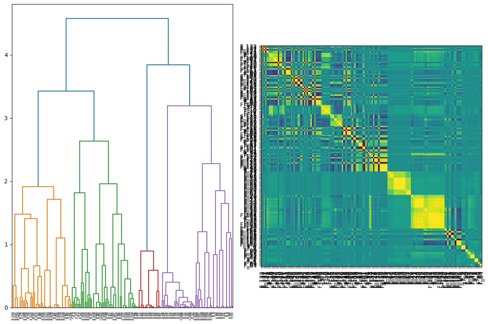
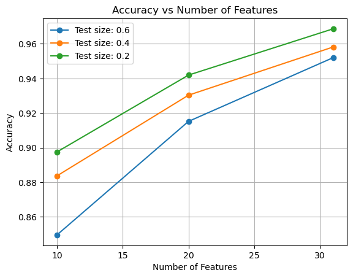
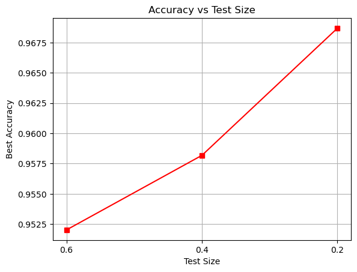

# Machine-Learning-for-Human-Authentication
This repository presents a re-implementation of my research on human authentication using PPG signals, originally published in IEEE Xplore(https://ieeexplore.ieee.org/document/7802164).

In this new Python-based implementation, I utilize a dendrogram-based method to reduce the number of features by analyzing their correlations.

The method leverages the CC function to compute the differences between the features of 10 supervisor beats and the beats in the train and test sets across 10 iterations.

For classification of 33 subjects, I employ the CatBoost classifier, optimizing its performance using GridSearch over different model parameters and 5-fold cross-validation.

With this approach, the model achieves ~97% accuracy when the test size is 0.2.

